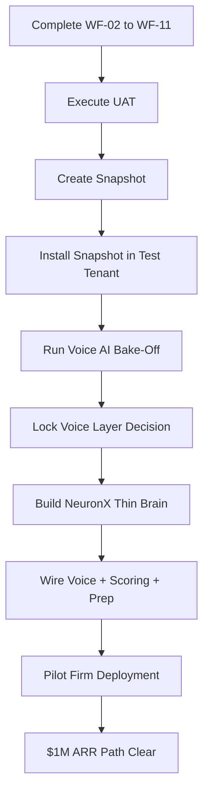

# NeuronX Comprehensive Project Audit Report

**Date**: 2026-03-21  
**Auditor**: Trae Document Agent  
**Status**: CANONICAL  
**Scope**: Full repository analysis from vision to implementation

---

## Executive Summary

### What NeuronX Is (Vision)
NeuronX is an AI-assisted sales and intake operating system for Canadian immigration consulting firms. It orchestrates the pre-retention pipeline (inquiry → retainer) using GoHighLevel as the mandatory CRM infrastructure and a thin intelligence layer for AI calling, readiness scoring, consultation preparation, and analytics.

### Current Build Status: **PHASE 1 IN PROGRESS** (Gold GHL Sub-Account Build)

**Overall Completion**: ~60% of Phase 1 (GHL Gold Build)

| Phase | Status | Completion |
|-------|--------|------------|
| **Phase 1**: GHL Gold Build (No Code) | 🟡 IN PROGRESS | ~60% |
| **Phase 2**: Snapshot Creation | ⚪ NOT STARTED | 0% |
| **Phase 3**: NeuronX Thin Brain | ⚪ NOT STARTED | 0% |
| **Phase 4**: Voice AI Bake-Off | ⚪ NOT STARTED | 0% |

---

## 1. Current State Analysis

### 1.1 Canonical Documentation (✅ COMPLETE)

**Status**: Product vision, requirements, and operating specifications are fully defined and authoritative.

| Document | Version | Status | Completeness |
|----------|---------|--------|--------------|
| <mcfile name="vision.md" path="/Users/ranjansingh/Desktop/NeuronX/docs/01_product/vision.md"></mcfile> | v3.0 | CANONICAL | 100% |
| <mcfile name="prd.md" path="/Users/ranjansingh/Desktop/NeuronX/docs/01_product/prd.md"></mcfile> | v3.0 | CANONICAL | 100% |
| <mcfile name="operating_spec.md" path="/Users/ranjansingh/Desktop/NeuronX/docs/02_operating_system/operating_spec.md"></mcfile> | v1.0 | CANONICAL | 100% |
| <mcfile name="sales_playbook.md" path="/Users/ranjansingh/Desktop/NeuronX/docs/02_operating_system/sales_playbook.md"></mcfile> | v1.0 | CANONICAL | 100% |
| <mcfile name="ghl_configuration_blueprint.md" path="/Users/ranjansingh/Desktop/NeuronX/docs/02_operating_system/ghl_configuration_blueprint.md"></mcfile> | v1.0 | CANONICAL | 100% |
| <mcfile name="product_boundary.md" path="/Users/ranjansingh/Desktop/NeuronX/docs/03_infrastructure/product_boundary.md"></mcfile> | v1.0 | CANONICAL | 100% |
| <mcfile name="trust_boundaries.md" path="/Users/ranjansingh/Desktop/NeuronX/docs/04_compliance/trust_boundaries.md"></mcfile> | v1.0 | CANONICAL | 100% |

**Key Strengths**:
- Clear product vision with vertical focus (immigration only)
- Detailed operational flows (10 workflows defined)
- Explicit trust boundaries (AI may/must not do)
- Configure-first principle enforced
- GHL as mandatory system of record

### 1.2 GHL Gold Sub-Account Build (🟡 ~60% COMPLETE)

**Location**: NeuronX Test Lab (`FlRL82M0D6nclmKT7eXH`)

#### ✅ COMPLETED Components

| Component | Status | Method | Evidence |
|-----------|--------|--------|----------|
| Custom Fields (41) | ✅ DONE | API | PROJECT_MEMORY.md |
| Tags (21) | ✅ DONE | API | PROJECT_MEMORY.md |
| Pipeline: NeuronX — Immigration Intake | ✅ DONE | Playwright | ID: `Dtj9nQVd3QjL7bAb3Aiw` |
| Calendar: Immigration Consultations | ✅ DONE | API | ID: `To1U2KbcvJ0EAX0RGKHS` |
| Form: Immigration Inquiry (V1) | ✅ DONE | Playwright | ID: `FNMmVXpfUvUypS0c4oQ3` |
| Funnel: NeuronX Intake Landing (V1) | ✅ DONE | Playwright | ID: `VmB52pLVfOShgksvmBir` |

#### 🟡 PARTIAL Components

| Component | Status | Progress | Blocker |
|-----------|--------|----------|---------|
| Workflows WF-01 to WF-11 | 🟡 PARTIAL | WF-01 configured | Skyvern session management issues |
| Form Dropdown Options | ⚪ PENDING | 0% | Waiting for workflow completion |
| Landing Page Content | ⚪ PENDING | 0% | Waiting for workflow completion |
| Message Templates | ⚪ PENDING | 0% | Waiting for workflow completion |

#### ⚪ NOT STARTED Components

| Component | Reason |
|-----------|--------|
| WF-02 through WF-11 | Skyvern execution paused after WF-01 |
| UAT Scenarios | Awaiting complete Gold build |
| Snapshot Creation | Awaiting Gold validation |

### 1.3 Automation Tooling Status

**Breakthrough Achievement**: Skyvern Cloud (Visual LLM) successfully automated workflow configuration on 2026-03-17, unlocking the previous "LOCKED" ceiling.

| Tool | Purpose | Status | Notes |
|------|---------|--------|-------|
| GHL API (V2) | Custom fields, tags, calendars | ✅ WORKING | Reliable for CRUD operations |
| Playwright | Pipeline, form, funnel creation | ✅ WORKING | Persistent auth session |
| Skyvern Cloud | Workflow configuration | 🟡 FUNCTIONAL | Session: `pbs_506976117979052016` |
| OAuth Marketplace Install | Sub-account access | ✅ WORKING | `.tokens.json` persisted |

**Key Finding**: The "manual plateau" has been broken. Complex UI automation (workflows, form builders) is now achievable via Skyvern.

### 1.4 Legacy Codebase (`/APP/*`)

**Status**: REFERENCE ONLY for MVP execution

The `/APP` directory contains ~90+ TypeScript packages representing a sophisticated orchestration backend with:
- Decision engines
- Playbook systems
- GHL adapters
- Voice orchestration
- Billing entitlements
- Compliance enforcement

**Canon Decision**: `/APP/*` is NOT the MVP build path. Phase 1-3 use GHL-first architecture.

**Disposition**: Open decision <mcfile name="open_decisions.md" path="/Users/ranjansingh/Desktop/NeuronX/docs/05_governance/open_decisions.md"></mcfile> (OD-09).

---

## 2. Gap Analysis

### 2.1 Critical Gaps (Blockers to $1M)

#### GAP-1: Incomplete Workflow Configuration ⚠️ HIGH PRIORITY

**What's Missing**: WF-02 through WF-11 (10 workflows)

**Impact**: Without these workflows, the system cannot:
- Execute contact attempt sequences (WF-02)
- Route assessed leads to booking (WF-04)
- Send consultation reminders (WF-06)
- Handle no-show recovery (WF-07)
- Deliver retainer follow-up (WF-09)

**Blocker**: Skyvern session management requires manual founder intervention for login persistence.

**Resolution Path**:
1. Founder logs into Skyvern session (`pbs_506976117979052016`)
2. Resume workflow configuration from WF-02
3. Complete all 11 workflows
4. Verify persistence after each workflow

**Estimated Time**: 2-4 hours (with founder login)

#### GAP-2: Voice AI Selection Not Locked ⚠️ HIGH PRIORITY

**Open Decision**: OD-01 — Voice layer selection (GHL Voice AI vs external providers)

**Impact**: Cannot build AI calling orchestration without knowing:
- Which API to integrate
- Cost structure
- Transcript format
- Trust boundary enforcement method

**Required Action**: Execute <mcfile name="live_tenant_bakeoff_scorecard.md" path="/Users/ranjansingh/Desktop/NeuronX/docs/03_infrastructure/live_tenant_bakeoff_scorecard.md"></mcfile>

**Bake-Off Scope**:
- **Track A**: GHL Voice AI (native)
- **Track B**: External providers (Vapi, Bland, Retell)
- **Track C**: Snapshot deployment reality test
- **Track D**: Webhook security validation

**Estimated Time**: 1-2 days

#### GAP-3: No End-to-End UAT Evidence ⚠️ MEDIUM PRIORITY

**What's Missing**: Executed UAT scenarios with proof:
- UAT-01: New lead lifecycle (happy path)
- UAT-02: No-show recovery
- UAT-03: Consent suppression
- UAT-04: Complex lead routing

**Impact**: Cannot validate that Gold sub-account delivers v1 outcomes.

**Resolution Path**:
1. Complete GAP-1 (workflows)
2. Configure form dropdowns
3. Edit landing page content
4. Execute UAT scenarios per blueprint
5. Record evidence in UAT report template

**Estimated Time**: 4-6 hours

### 2.2 Architectural Gaps

#### GAP-4: NeuronX Orchestration Layer Not Built

**Status**: Phase 3 (deferred until GHL gaps proven)

**What's Needed**:
- Webhook receiver (GHL + voice provider)
- Readiness scorer
- Consultation prep assembler
- Analytics engine
- Trust boundary enforcer

**Estimated LOC**: ~1,800 lines (per capability audit)

**Estimated Time**: 2-3 days for competent developer

#### GAP-5: Snapshot Distribution Model Not Proven

**Status**: Phase 2 (awaiting Gold validation)

**Uncertainty**: GHL Snapshot API support is partial. Manual/semi-manual install may be required.

**Impact**: Onboarding model may remain premium (manual) in v1.

### 2.3 Decision Gaps (13 Open Decisions)

From <mcfile name="open_decisions.md" path="/Users/ranjansingh/Desktop/NeuronX/docs/05_governance/open_decisions.md"></mcfile>:

| # | Decision | Impact | Priority |
|---|----------|--------|----------|
| OD-01 | Voice layer selection | HIGH | Must resolve before Phase 3 |
| OD-02 | Pricing tiers | MEDIUM | Affects SaaS business model |
| OD-05 | Snapshot deployment process | MEDIUM | Affects onboarding model |
| OD-07 | Analytics implementation | LOW | GHL native may suffice for v1 |
| OD-09 | Existing codebase disposition | LOW | Reference vs salvage decision |
| OD-13 | V1 tech boundary | HIGH | GHL + thin wrapper vs full backend |

**Recommendation**: Resolve OD-01, OD-05, OD-13 before architecture phase.

---

## 3. Critical Path Items (Blockers to $1M ARR)

### Critical Path Sequence

### Milestone Definitions

| Milestone | Definition | Exit Criteria |
|-----------|------------|---------------|
| M1: Gold Complete | All 11 workflows configured + UAT pass | UAT report signed off |
| M2: Snapshot Proven | Snapshot created + installed + re-validated | UAT pass in snapshot tenant |
| M3: Voice Locked | Bake-off complete + OD-01 resolved | Voice provider contract signed |
| M4: Orchestration Live | NeuronX thin brain deployed + wired | End-to-end AI call → GHL update works |
| M5: Pilot Deployed | First paying customer onboarded | Retainer signed via NeuronX flow |

### Time to $1M Estimate

**Optimistic Path** (assumes no major blockers):
- M1: +1 week
- M2: +1 week
- M3: +1 week
- M4: +1 week
- M5: +2 weeks
- **Total**: 6 weeks to first pilot customer

**Scale to $1M ARR**:
- Target: 50 firms @ $1,500/month avg = $900K ARR
- Assumes 10% conversion from pilots
- Assumes 6-month sales cycle
- **Realistic Timeline**: 12-18 months from M5

---

## 4. Prioritized Action Plan

### Phase 1: Complete Gold (IMMEDIATE)

**Owner**: Technical execution + founder login support  
**Duration**: 1 week  
**Exit Criteria**: All 11 workflows configured, UAT passed

#### Block 1: Workflow Configuration (Days 1-3)
1. ✅ **Resume Skyvern session** (founder login)
2. ⚠️ **Configure WF-02** (Contact Attempts) via Skyvern
3. ⚠️ **Configure WF-03** (Mark Contacted) via Skyvern
4. ⚠️ **Configure WF-04** (Readiness Complete → Invite) via Skyvern
5. ⚠️ **Configure WF-05** (Appointment Booked) via Skyvern
6. ⚠️ **Configure WF-06** (Reminders) via Skyvern
7. ⚠️ **Configure WF-07** (No-Show Recovery) via Skyvern
8. ⚠️ **Configure WF-08** (Outcome Routing) via Skyvern
9. ⚠️ **Configure WF-09** (Retainer Follow-Up) via Skyvern
10. ⚠️ **Configure WF-10** (Post-Consult Follow-Up) via Skyvern
11. ⚠️ **Configure WF-11** (Nurture Campaign) via Skyvern

#### Block 2: Content & Configuration (Days 4-5)
1. ⚠️ **Configure form dropdown options** (API or Playwright)
2. ⚠️ **Edit landing page content** (compliance copy, trust signals)
3. ⚠️ **Create message templates** (SMS/email per playbook)
4. ⚠️ **Delete junk workflows** (cleanup)

#### Block 3: UAT Execution (Days 6-7)
1. ⚠️ **Execute UAT-01** (happy path: form → contacted → booked → retainer)
2. ⚠️ **Execute UAT-02** (no-show recovery)
3. ⚠️ **Execute UAT-03** (consent suppression)
4. ⚠️ **Execute UAT-04** (complex lead routing)
5. ⚠️ **Document evidence** (screenshots, logs, field values)
6. ✅ **Sign off UAT report**

### Phase 2: Snapshot Productization (WEEK 2)

**Owner**: Technical execution  
**Duration**: 1 week  
**Exit Criteria**: Snapshot created, installed in second tenant, re-validated

#### Actions
1. ⚠️ **Create snapshot from Gold** (GHL UI)
2. ⚠️ **Record snapshot ID and share link**
3. ⚠️ **Create second test sub-account**
4. ⚠️ **Install snapshot** (manual or Playwright)
5. ⚠️ **Re-run UAT-01 in snapshot tenant**
6. ⚠️ **Measure install time and manual steps**
7. ⚠️ **Document onboarding playbook**

### Phase 3: Voice AI Bake-Off (WEEK 3)

**Owner**: Technical evaluation + founder approval  
**Duration**: 1 week  
**Exit Criteria**: OD-01 resolved, voice provider locked

#### Track A: GHL Voice AI
1. ⚠️ **Configure GHL Voice AI agent**
2. ⚠️ **Test R1-R5 readiness questions**
3. ⚠️ **Validate trust boundary enforcement**
4. ⚠️ **Test booking during call**
5. ⚠️ **Score against bake-off scorecard**

#### Track B: External Voice (Vapi as candidate)
1. ⚠️ **Provision Vapi assistant**
2. ⚠️ **Configure immigration-specific prompts**
3. ⚠️ **Test webhook → GHL field update**
4. ⚠️ **Score against bake-off scorecard**

#### Track D: Webhook Security
1. ⚠️ **Verify X-GHL-Signature (Ed25519)**
2. ⚠️ **Test replay protection (timestamp + webhookId)**
3. ⚠️ **Document verification implementation**

#### Decision
1. ⚠️ **Compare Track A vs Track B scores**
2. ⚠️ **Founder approves voice layer**
3. ⚠️ **Update product_boundary.md**
4. ⚠️ **Resolve OD-01 in open_decisions.md**

### Phase 4: NeuronX Thin Brain (WEEK 4)

**Owner**: Backend developer  
**Duration**: 1 week  
**Exit Criteria**: Orchestration service deployed, AI call → GHL update working end-to-end

#### Components to Build
1. ⚠️ **Webhook receiver** (GHL + voice provider)
2. ⚠️ **Voice orchestrator** (initiate call, process result)
3. ⚠️ **Readiness scorer** (parse transcript, calculate R1-R5)
4. ⚠️ **Consultation prep assembler** (pull GHL data, format briefing)
5. ⚠️ **Trust boundary enforcer** (rules engine + compliance log)
6. ⚠️ **Minimal data store** (transcripts, scoring history, audit log)

#### Integration Points
1. ⚠️ **GHL webhook → NeuronX**
2. ⚠️ **NeuronX → Voice provider API**
3. ⚠️ **Voice provider callback → NeuronX**
4. ⚠️ **NeuronX → GHL API (field updates)**
5. ⚠️ **NeuronX → Email (briefing delivery)**

### Phase 5: Pilot Deployment (WEEKS 5-6)

**Owner**: Founder + implementation team  
**Duration**: 2 weeks  
**Exit Criteria**: First paying customer onboarded, system live

#### Actions
1. ⚠️ **Identify pilot customer** (ICP: 50-500 inquiries/month)
2. ⚠️ **Create firm sub-account**
3. ⚠️ **Install snapshot**
4. ⚠️ **Configure voice provider credentials**
5. ⚠️ **Customize branding** (firm name, logo, colors)
6. ⚠️ **Train firm team** (intake coordinator, consultants)
7. ⚠️ **Go live**
8. ⚠️ **Monitor first 10 leads**
9. ⚠️ **Collect feedback**
10. ⚠️ **Iterate**

---

## 5. Risk Assessment

| Risk | Probability | Impact | Mitigation |
|------|-------------|--------|------------|
| Skyvern session expires during workflow build | HIGH | HIGH | Founder login SOP; save after each workflow |
| GHL Voice AI fails bake-off | MEDIUM | HIGH | External voice provider fallback ready |
| Snapshot install requires manual steps | HIGH | MEDIUM | Premium onboarding model (acceptable) |
| Pilot customer churns before retainer signed | MEDIUM | MEDIUM | Free trial + success guarantee |
| Voice provider pricing changes | LOW | HIGH | Multi-provider architecture from day 1 |
| GHL API rate limits hit | LOW | MEDIUM | Request rate limit increase |
| Trust boundary violation in production | LOW | CRITICAL | Mandatory compliance audit log + monitoring |

---

## 6. Resource Requirements

### Immediate Needs (Weeks 1-4)

| Role | Capacity | Duration | Tasks |
|------|----------|----------|-------|
| Founder | 2 hrs/week | 4 weeks | Login support, voice bake-off approval, pilot customer selection |
| Technical Execution (Trae/Agent) | Full-time | 3 weeks | Workflow config, UAT, snapshot, bake-off |
| Backend Developer | Full-time | 1 week | NeuronX thin brain build |

### Post-Pilot Needs (Months 2-6)

| Role | Capacity | Tasks |
|------|----------|-------|
| Sales/BD | Part-time | Customer pipeline |
| Implementation Specialist | Per-customer | Snapshot install + training |
| Support Engineer | Part-time | Monitor pilot, fix issues |

---

## 7. Success Metrics

### Phase 1 Success Criteria
- ✅ All 11 workflows configured and published
- ✅ All 4 UAT scenarios passed
- ✅ UAT report signed off
- ✅ Zero trust boundary violations in test data

### Phase 2 Success Criteria
- ✅ Snapshot created
- ✅ Snapshot installed in second tenant
- ✅ UAT-01 re-passed in snapshot tenant
- ✅ Install time documented (< 30 min ideal)

### Phase 3 Success Criteria
- ✅ Voice layer locked (GHL or external)
- ✅ Bake-off scorecard completed
- ✅ OD-01 resolved
- ✅ Webhook security validated

### Phase 4 Success Criteria
- ✅ End-to-end test: Submit form → AI call → Readiness scored → GHL updated
- ✅ Consultation briefing delivered to consultant
- ✅ Trust boundary enforcer active
- ✅ Compliance audit log populated

### Phase 5 Success Criteria
- ✅ First pilot customer signed
- ✅ System live and processing real leads
- ✅ First consultation booked via NeuronX
- ✅ First retainer signed via NeuronX

---

## 8. Governance & Authority

### Document Hierarchy (Truth Source)

1. <mcfile name="trust_boundaries.md" path="/Users/ranjansingh/Desktop/NeuronX/docs/04_compliance/trust_boundaries.md"></mcfile> — **OVERRIDES EVERYTHING**
2. <mcfile name="vision.md" path="/Users/ranjansingh/Desktop/NeuronX/docs/01_product/vision.md"></mcfile> — Product direction
3. <mcfile name="prd.md" path="/Users/ranjansingh/Desktop/NeuronX/docs/01_product/prd.md"></mcfile> — Requirements
4. <mcfile name="operating_spec.md" path="/Users/ranjansingh/Desktop/NeuronX/docs/02_operating_system/operating_spec.md"></mcfile> — Implementation
5. <mcfile name="product_boundary.md" path="/Users/ranjansingh/Desktop/NeuronX/docs/03_infrastructure/product_boundary.md"></mcfile> — System boundaries

### Non-Negotiable Constraints

**From Project Rules**:
1. `/APP/*` is reference only for MVP
2. GHL is mandatory system of record
3. Configure-first, code-last
4. No shadow CRM
5. Trust boundaries are hard constraints
6. Founder approval required for canon changes

---

## 9. Recommendations

### Immediate Actions (This Week)

1. **Resume Skyvern workflow configuration**
   - Priority: CRITICAL
   - Owner: Technical execution + founder login
   - Blocker: Founder must log into Skyvern session
   
2. **Resolve OD-13 (Tech Boundary Decision)**
   - Priority: HIGH
   - Decision: GHL + thin wrapper (recommended) vs full backend
   - Impact: Determines Phase 4 scope

3. **Schedule Voice Bake-Off**
   - Priority: HIGH
   - Duration: 2-3 days
   - Output: OD-01 resolution

### Strategic Recommendations

1. **Accept Manual Onboarding for v1**
   - Snapshot install may require 30-60 min manual setup
   - This supports premium pricing ($500-$1,500/month)
   - Self-serve can be deferred to v2

2. **Prefer GHL Voice AI if it passes bake-off**
   - Reduces external dependencies
   - Simplifies architecture
   - Lowers NeuronX wrapper scope

3. **Salvage Decision on `/APP` Codebase**
   - Many packages (billing-entitlements, decision-engine, playbook-governance) are high-quality
   - Recommend: Selective salvage for v1.5+
   - Do NOT block v1 launch on codebase refactor

4. **Focus on Pilot Success**
   - 1 successful pilot > 10 incomplete builds
   - Target firm with 100-200 inquiries/month
   - Provide white-glove support
   - Capture testimonial + case study

---

## 10. Conclusion

### Current Position
NeuronX has **excellent product vision** and **60% of GHL Gold build complete**. The breakthrough in Skyvern automation (2026-03-17) unlocked the final technical barrier to completing the Gold build.

### What Works
- ✅ Clear vertical focus (immigration only)
- ✅ GHL-first architecture validated
- ✅ Automation tooling proven
- ✅ Canon documentation complete

### What's Blocking $1M
- ⚠️ 10 workflows incomplete (WF-02 to WF-11)
- ⚠️ Voice layer not selected
- ⚠️ No end-to-end UAT proof
- ⚠️ No pilot customer deployed

### Path Forward
**6 weeks to pilot customer** is achievable if:
1. Workflows completed this week
2. Voice bake-off next week
3. Orchestration layer built week 3-4
4. Pilot onboarded week 5-6

### Final Recommendation
**Execute the Critical Path**. The vision is sound, the architecture is validated, and the tools are ready. The remaining work is execution, not discovery.

---

**Next Immediate Action**: Resume Skyvern workflow configuration (requires founder login to session `pbs_506976117979052016`).
