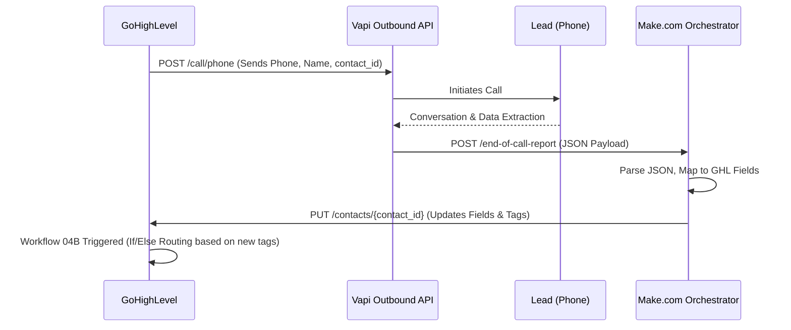

# AI Pipeline Integration Architecture

## The Data Pipeline



## The Payload Mappings

### 1. GHL to Vapi (The Trigger)
Sent from GHL `WF-01A` Webhook Action.
```json
{
  "phoneNumberId": "TENANT_SPECIFIC_PHONE_ID",
  "customer": {
    "number": "{{contact.phone}}",
    "name": "{{contact.first_name}}"
  },
  "assistantId": "TENANT_SPECIFIC_ASSISTANT_ID",
  "assistantOverrides": {
    "variableValues": {
      "first_name": "{{contact.first_name}}",
      "contact_id": "{{contact.id}}" 
    }
  }
}
```

### 2. Make.com to GHL (The Result)
Sent from Make.com to `https://services.leadconnectorhq.com/contacts/{contact_id}`.

| Vapi Extraction Data | Maps to GHL Custom Field |
| :--- | :--- |
| `toolCalls.capture_lead_data.program_interest` | `ai_program_interest` |
| `toolCalls.capture_lead_data.urgency` | `ai_urgency` |
| `toolCalls.capture_lead_data.complexity_flag` | `ai_complexity_flag` |
| `toolCalls.end_call_summary.summary` | `ai_summary` |
| `toolCalls.escalate_to_human.requires_human` | Adds Tag: `nx:human_escalation` |

## Resilience Patterns
- **Retry Logic**: If the GHL API is rate-limited, Make.com uses an "Error Handler" module to pause 60 seconds and retry the `PUT` request up to 3 times.
- **Voicemail Fallback**: If Vapi detects a voicemail, it returns `call_outcome: voicemail`. Make.com passes this to GHL, which triggers `WF-02` (Wait 2 hours, try again).