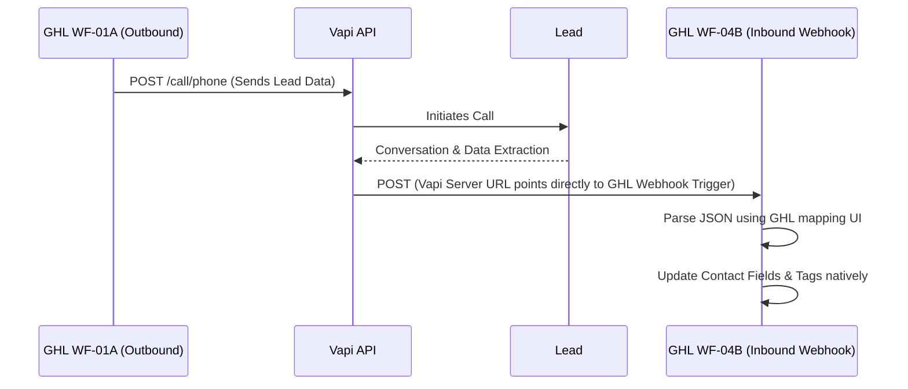

# Minimal Vapi <-> GHL Architecture (v1)

## Executive Summary
This document re-evaluates the necessity of a third-party orchestration layer (Make.com/n8n) between GoHighLevel and Vapi. Following the "Minimalist Architecture Principle," we have audited whether GHL's native Inbound Webhook triggers can handle Vapi's `end-of-call-report` directly.

**Verdict: A. GHL + Vapi only is enough for v1.**
Make.com and n8n are officially **REMOVED** from the v1 MVP scope.

## 1. The Direct Architecture

## 2. What Works WITHOUT Make/n8n

GoHighLevel recently upgraded its "Inbound Webhook" trigger capabilities. It can now:
1. Receive deeply nested JSON payloads.
2. Use a visual JSON path mapper (e.g., `message.toolCalls[0].function.arguments.program_interest`) to extract specific variables.
3. Save those mapped variables directly to Custom Fields on the Contact record.
4. Execute If/Else logic based on those extracted variables.

Because we explicitly designed our Vapi Agent to use strict **Function Calling** (`capture_lead_data`, `score_lead`), the data Vapi returns is already structured JSON. It does not require a third-party parser.

### Direct Data Flow (Vapi -> GHL)
When Vapi finishes a call, it sends an `end-of-call-report` to the `serverUrl`. By pasting a GHL Inbound Webhook URL into the Vapi `serverUrl` field, GHL can directly map:
- `message.toolCalls[0].function.arguments.program_interest` -> `ai_program_interest`
- `message.toolCalls[0].function.arguments.urgency` -> `ai_urgency`
- `message.call.status` -> To determine if it went to voicemail.

## 3. What is Deferred to v2 (Because Make/n8n is removed)

By removing the orchestration layer, we lose the ability to do complex data transformations *mid-flight*. The following features are deferred to v2:

1. **The LLM "Pre-Consultation Briefing"**: We cannot easily pass the Vapi output through a secondary GPT-4 prompt to rewrite it into a beautiful PDF before dropping it into GHL. For v1, the raw Vapi `summary` string will be dropped directly into the GHL Contact Notes.
2. **Aggregating Multiple Tool Calls**: If the AI calls `capture_lead_data` three separate times in one conversation, GHL's basic JSON mapper struggles to aggregate arrays. We will solve this by instructing Vapi via the system prompt to only call the data extraction function *once* at the very end of the call.
3. **Advanced Retry Logic**: If GHL's webhook receiver goes down, Vapi will fail to deliver the payload. Make.com's "Error Handler / Auto-Retry" is lost.

## 4. Implementation Steps

1. **Create GHL Webhook Trigger**: Create a new workflow in GHL (`WF-04B - AI Call Receiver`). Set the trigger to "Inbound Webhook".
2. **Copy Webhook URL**: Copy the URL provided by GHL.
3. **Update Vapi**: Go to the Vapi Dashboard -> Assistant -> Advanced -> Server URL. Paste the GHL Webhook URL.
4. **Test & Map**: Run a test call. Vapi will hit the GHL webhook. In GHL, click "Fetch Sample Request" and map the incoming JSON nodes to the corresponding Custom Fields.