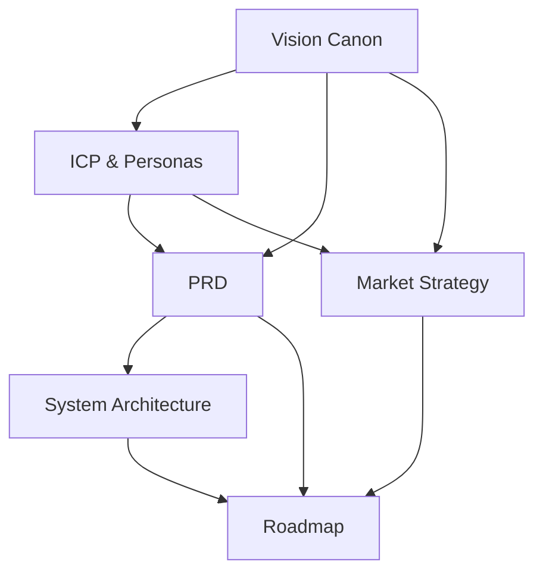

# NeuronX Product Canon

**Version**: v1.0  
**Owner**: Antigravity (CTO)  
**Ratified By**: Founder  
**Status**: CANONICAL  
**Last Updated**: 2026-01-29

---

## Purpose

This directory contains the **Product Canon** — the single source of truth for all product decisions regarding NeuronX.

**Product Canon** establishes authoritative product truth before execution begins. Every feature, architecture decision, and market strategy must trace back to these canonical documents.

---

## Document Structure

### Core Documents (Must Read in Order)

1. **[Vision Canon](file:///Users/ranjansingh/Desktop/NeuronX/PRODUCT/VISION_CANON.md)** ⭐  
   *What NeuronX is, the problem it solves, and long-term vision*

2. **[ICP & Personas](file:///Users/ranjansingh/Desktop/NeuronX/PRODUCT/ICP_AND_PERSONAS.md)** 👥  
   *Who we build for: GHL agency owners, operations managers, and end users*

3. **[PRD (Product Requirements Document)](file:///Users/ranjansingh/Desktop/NeuronX/PRODUCT/PRD.md)** 📋  
   *Comprehensive functional requirements, user journeys, and quality bars*

4. **[System Architecture](file:///Users/ranjansingh/Desktop/NeuronX/PRODUCT/SYSTEM_ARCHITECTURE.md)** 🏗️  
   *Three-layer architecture, service breakdown, and deployment strategy*

5. **[Market Strategy](file:///Users/ranjansingh/Desktop/NeuronX/PRODUCT/MARKET_STRATEGY.md)** 💰  
   *Pricing, GTM strategy, competitive positioning, and path to $10M ARR*

6. **[Roadmap](file:///Users/ranjansingh/Desktop/NeuronX/PRODUCT/ROADMAP.md)** 🗺️  
   *Milestone-based execution plan from MVP through Multi-CRM*

---

## Document Relationships



**Flow**:
1. Vision defines what we are
2. ICP defines who we serve
3. PRD defines what we build
4. Architecture defines how we build it
5. Market Strategy defines how we sell it
6. Roadmap defines when we ship it

---

## How to Use Product Canon

### For Antigravity (CTO)

**Before Planning Any Work**:
1. Read [Vision Canon](file:///Users/ranjansingh/Desktop/NeuronX/PRODUCT/VISION_CANON.md) (mandatory startup)
2. Verify alignment with ICP and PRD
3. Check roadmap for priority and timing
4. Create PLAN artifact that references canonical docs

**When Creating Tasks**:
- Every task must trace back to PRD requirement
- Every architecture decision must align with System Architecture
- Every market claim must match Market Strategy

### For Factory (Execution)

**Before Implementing Features**:
1. Verify feature exists in PRD (FR-* requirement)
2. Check priority (P0/P1/P2)
3. Follow System Architecture patterns
4. Reference canonical docs in commit messages

**Example**:
```
feat(ghl-adapter): implement bidirectional contact sync

Implements FR-GHL-1 from canonical PRD.
Aligned with System Architecture §3.6.

References:
- PRD: file:///Users/ranjansingh/Desktop/NeuronX/PRODUCT/PRD.md#fr-ghl-1
- Architecture: file:///Users/ranjansingh/Desktop/NeuronX/PRODUCT/SYSTEM_ARCHITECTURE.md#3-6
```

### For Trae (Auditor)

**When Reviewing Changes**:
1. Verify alignment with Vision Canon (non-goals, philosophy)
2. Check compliance with PRD security requirements
3. Validate market claims against Market Strategy
4. Ensure roadmap timing is realistic

---

## Governance Rules

### Who Can Modify Product Canon

| Document | Who Can Modify | Approval Required |
|----------|----------------|-------------------|
| **Vision Canon** | Founder only | N/A (founder is authority) |
| **ICP & Personas** | Antigravity | Founder approval |
| **PRD** | Antigravity | Founder approval for P0/P1 changes |
| **System Architecture** | Antigravity | Trae review (if security impact) |
| **Market Strategy** | Antigravity | Founder approval for pricing/GTM |
| **Roadmap** | Antigravity | Founder approval for milestone dates |

### Modification Process

1. **Propose Change**: Create RFC document in COCKPIT/artifacts/RFC/
2. **Review**: Trae reviews if affects security/compliance
3. **Approve**: Founder approves via Approvals Queue
4. **Update**: Antigravity updates canonical document
5. **Version**: Increment version number + add to version history
6. **Notify**: Update task.md and STATUS_LEDGER

### Version Control

All Product Canon documents use semantic versioning:
- **Major** (v2.0): Breaking changes, fundamental shifts
- **Minor** (v1.1): New sections, significant additions
- **Patch** (v1.0.1): Typos, clarifications, formatting

---

## Relationship to Framework (AE-OS)

### Framework vs Product

| Aspect | Framework (AE-OS) | Product (NeuronX) |
|--------|-------------------|-------------------|
| **What** | Development infrastructure | Business orchestration platform |
| **Location** | FOUNDATION/, GOVERNANCE/, AGENTS/ | PRODUCT/ (this directory) |
| **Who Uses** | Antigravity, Factory (development) | Customers (agencies, SaaS platforms) |
| **Canon** | FOUNDATION/01_VISION.md | PRODUCT/VISION_CANON.md |

### Two Distinct Products

NeuronX repository contains **two products**:

1. **Autonomous Engineering OS** (framework)  
   - Documented in FOUNDATION/
   - Enables autonomous development of NeuronX
   - Future SaaS product (2027+)

2. **NeuronX Business Orchestration Platform** (current product)  
   - Documented in PRODUCT/ (this directory)
   - SaaS for GHL agencies (2026)
   - Built using AE-OS framework

**Strategic Relationship**:
- NeuronX revenue funds AE-OS development
- NeuronX validates AE-OS framework
- Both share governance model and quality standards

---

## Quick Reference

### Common Questions

**Q: Where do I find the ICP?**  
A: [ICP_AND_PERSONAS.md](file:///Users/ranjansingh/Desktop/NeuronX/PRODUCT/ICP_AND_PERSONAS.md)

**Q: What's the pricing model?**  
A: [MARKET_STRATEGY.md](file:///Users/ranjansingh/Desktop/NeuronX/PRODUCT/MARKET_STRATEGY.md) §3

**Q: When is MVP shipping?**  
A: [ROADMAP.md](file:///Users/ranjansingh/Desktop/NeuronX/PRODUCT/ROADMAP.md) §3

**Q: What's a P0 requirement?**  
A: [PRD.md](file:///Users/ranjansingh/Desktop/NeuronX/PRODUCT/PRD.md) §3 (P0 = Critical, must have)

**Q: How does GHL integration work?**  
A: [SYSTEM_ARCHITECTURE.md](file:///Users/ranjansingh/Desktop/NeuronX/PRODUCT/SYSTEM_ARCHITECTURE.md) §3.6

**Q: Why are we building this?**  
A: [VISION_CANON.md](file:///Users/ranjansingh/Desktop/NeuronX/PRODUCT/VISION_CANON.md) §2

---

## Verification Checklist

Before any major work begins, verify:

- [ ] Work aligns with [Vision Canon](file:///Users/ranjansingh/Desktop/NeuronX/PRODUCT/VISION_CANON.md) (what we are)
- [ ] Serves defined [ICP](file:///Users/ranjansingh/Desktop/NeuronX/PRODUCT/ICP_AND_PERSONAS.md) (who we build for)
- [ ] Implements [PRD](file:///Users/ranjansingh/Desktop/NeuronX/PRODUCT/PRD.md) requirement (what we build)
- [ ] Follows [System Architecture](file:///Users/ranjansingh/Desktop/NeuronX/PRODUCT/SYSTEM_ARCHITECTURE.md) patterns (how we build)
- [ ] Supports [Market Strategy](file:///Users/ranjansingh/Desktop/NeuronX/PRODUCT/MARKET_STRATEGY.md) (how we sell)
- [ ] Scheduled in [Roadmap](file:///Users/ranjansingh/Desktop/NeuronX/PRODUCT/ROADMAP.md) (when we ship)

**If any checkbox is unchecked → STOP and clarify before proceeding.**

---

## Document Status

| Document | Version | Status | Last Updated |
|----------|---------|--------|--------------|
| Vision Canon | v1.0 | CANONICAL | 2026-01-29 |
| ICP & Personas | v1.0 | CANONICAL | 2026-01-29 |
| PRD | v2.0 | CANONICAL | 2026-01-29 |
| System Architecture | v1.0 | CANONICAL | 2026-01-29 |
| Market Strategy | v1.0 | CANONICAL | 2026-01-29 |
| Roadmap | v1.0 | CANONICAL | 2026-01-29 |

All documents ratified by Founder and marked **CANONICAL**.

---

## Next Review

**Quarterly Product Canon Review**: 2026-04-29

Review triggers:
- Milestone completion (MVP, V1, V2, etc.)
- Major market changes (competitor launches, GHL policy changes)
- Customer feedback requiring pivots
- Revenue/growth significantly above/below projections

---

**Status**: CANONICAL  
**Maintained By**: Antigravity (CTO)
