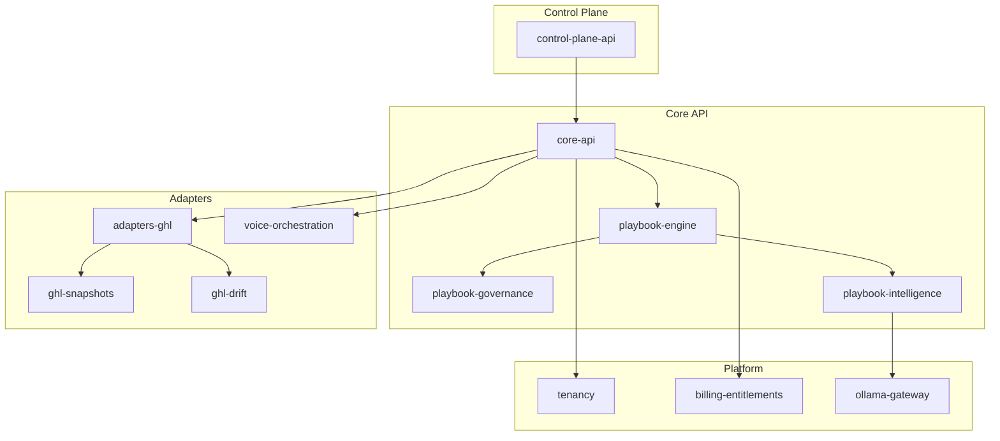

# NeuronX System Architecture

**Version**: v1.0  
**Owner**: Antigravity (CTO)  
**Ratified By**: Founder  
**Status**: CANONICAL  
**Last Updated**: 2026-01-29

**References**:
- [Product Vision Canon](file:///Users/ranjansingh/Desktop/NeuronX/PRODUCT/VISION_CANON.md)
- [PRD](file:///Users/ranjansingh/Desktop/NeuronX/PRODUCT/PRD.md)

---

## 1. Architecture Overview

NeuronX uses a **three-layer architecture** pattern:

```
┌─────────────────────────────────────────────┐
│  Intelligence Layer (AI-Enhanced Logic)     │
├─────────────────────────────────────────────┤
│  Orchestration Layer (Playbook Engine)      │
├─────────────────────────────────────────────┤
│  Adapter Layer (GHL, Voice, External APIs)  │
└─────────────────────────────────────────────┘
```

### Design Principles

1. **Adapter Pattern**: External systems integrated via adapters (GHL, voice providers)
2. **Event-Driven**: Webhooks and events trigger playbook execution
3. **Multi-Tenant**: Workspace isolation at database and execution level
4. **Deterministic Core**: Playbook engine is fully reproducible
5. **Observability First**: Every action logged and traceable

---

## 2. Service Architecture

### 2.1 Core Services



---

## 3. Service Descriptions

### 3.1 Control Plane API (`control-plane-api`)

**Purpose**: User-facing API for dashboard and configuration

**Responsibilities**:
- User authentication and authorization
- Workspace management
- Playbook CRUD operations
- Monitoring dashboards

**Technology**: **TypeScript + NestJS** + PostgreSQL (Prisma ORM)

**Key Endpoints**:
- `POST /workspaces` - Create new agency workspace (maps to GHL sub-account)
- `GET /playbooks` - List all playbooks
- `POST /playbooks/{id}/deploy` - Deploy playbook to clients
- `GET /analytics` - Dashboard analytics

---

### 3.2 Core API (`core-api`)

**Purpose**: Business logic orchestration layer

**Responsibilities**:
- Route requests to appropriate services
- Enforce multi-tenancy
- Coordinate playbook execution
- Event bus management

**Technology**: **TypeScript + NestJS** + Redis (ioredis) + PostgreSQL (Prisma)

**Key Components**:
- Event dispatcher
- ~~Tenant context manager~~ (DEPRECATED - use GHL sub-accounts)
- Service coordinator
- Webhook handlers

---

### 3.3 Playbook Engine (`playbook-engine`)

**Purpose**: Deterministic business logic execution

**Responsibilities**:
- Parse playbook definitions (YAML/JSON)
- Execute workflows step-by-step
- Maintain execution state
- Handle retries and failures

**Technology**: **TypeScript** + @neuronx/pipeline (custom workflow engine)

**Execution Model**:
```
Trigger → Load Playbook → Execute Steps → Update CRM → Log Results
```

**State Transitions**:
- PENDING → RUNNING → COMPLETED
- PENDING → RUNNING → FAILED → RETRYING → COMPLETED

---

### 3.4 Playbook Governance (`playbook-governance`)

**Purpose**: Enforce business rules during execution

**Responsibilities**:
- Validate playbook against policies
- Block policy violations
- Audit trail generation
- Compliance reporting

**Technology**: Python + rule engine

**Example Rules**:
- "CRM must be updated within 5 minutes of call completion"
- "High-value leads require human review"
- "No playbook can delete data without approval"

---

### 3.5 Playbook Intelligence (`playbook-intelligence`)

**Purpose**: AI-enhanced decision making

**Responsibilities**:
- Lead scoring and classification
- Sentiment analysis
- Predictive next actions
- Anomaly detection

**Technology**: Python + LLM integration (via ollama-gateway)

**Use Cases**:
- Classify lead intent from call transcript
- Predict best time to follow up
- Detect drift in customer behavior

---

### 3.6 GHL Adapter (`adapters-ghl`)

**Purpose**: Two-way sync with GoHighLevel CRM

**Responsibilities**:
- Webhook ingestion from GHL
- API calls to GHL (contacts, opportunities)
- Rate limiting and retry logic
- Error handling and logging

**Technology**: FastAPI + webhooks

**Integration Points**:
- GHL Contacts API
- GHL Opportunities API
- GHL Workflows API
- GHL Custom Fields API

---

### 3.7 GHL Snapshots (`ghl-snapshots`)

**Purpose**: Programmatic snapshot deployment

**Responsibilities**:
- Deploy GHL snapshots to new workspaces
- Parameterize templates (replace {{variables}})
- Validate deployment success
- Rollback on failure

**Technology**: Python + GHL Snapshots API

**Workflow**:
1. Load snapshot template
2. Replace parameters (client name, phone, etc.)
3. Deploy to GHL workspace
4. Verify all workflows imported
5. Generate deployment report

---

### 3.8 GHL Drift Detection (`ghl-drift`)

**Purpose**: Detect configuration drift

**Responsibilities**:
- Compare live GHL config to source snapshot
- Identify differences (added/modified/deleted)
- Alert on significant drift
- Suggest corrections

**Technology**: Python + diffing algorithm

**Detection Logic**:
- Daily scan of all managed workspaces
- Compare workflow definitions
- Flag \>10% deviation as drift
- Provide one-click correction

---

### 3.9 Voice Orchestration (`voice-orchestration`)

**Purpose**: Route and manage AI voice calls

**Responsibilities**:
- Inbound call routing
- Outbound call initiation
- CRM context injection
- Post-call analysis

**Technology**: FastAPI + voice provider SDKs (Bland, Vapi)

**Call Flow**:
```
1. Inbound call received
2. Lookup contact in GHL by phone number
3. Load contact context (history, notes, custom fields)
4. Inject context into voice AI prompt
5. Connect call
6. Log transcript + analysis
7. Update GHL with call outcome
```

---

### 3.10 Tenancy Service (`tenancy`)

**Purpose**: Multi-tenant data isolation

**Responsibilities**:
- Workspace-level authentication
- Data isolation by workspace_id
- Cross-tenant access prevention
- Audit logging per workspace

**Technology**: PostgreSQL row-level security

**Isolation Model**:
- Every DB row tagged with `workspace_id`
- API requests authenticated with workspace context
- Database enforces row-level security policies

---

### 3.11 Billing & Entitlements (`billing-entitlements`)

**Purpose**: Usage tracking and subscription management

**Responsibilities**:
- Meter playbook executions
- Track API call usage
- Enforce tier limits
- Generate invoices

**Technology**: Stripe integration + PostgreSQL

**Usage Metering**:
- Playbook executions per month
- Voice minutes per month
- API calls per month
- CRM sync operations per month

**Subscription Tiers**:
- **Starter**: 100 playbook executions/month, $299/month
- **Growth**: 1,000 playbook executions/month, $799/month
- **Enterprise**: Unlimited, custom pricing

---

### 3.12 Ollama Gateway (`ollama-gateway`)

**Purpose**: Centralized AI inference with cost control

**Responsibilities**:
- Route LLM requests to providers (OpenAI, Claude, local Ollama)
- Rate limiting per workspace
- Cost tracking per AI call
- Model fallback if primary unavailable

**Technology**: FastAPI + LLM SDKs

**Supported Models**:
- GPT-4 (via OpenAI)
- Claude 3.5 Sonnet (via Anthropic)
- Llama 3 (via local Ollama instance)

---

## 4. Data Architecture

### 4.1 Database Schema (High-Level)

```sql
-- Workspaces (agencies)
CREATE TABLE workspaces (
    id UUID PRIMARY KEY,
    name VARCHAR(255),
    ghl_location_id VARCHAR(255),
    subscription_tier VARCHAR(50),
    created_at TIMESTAMP
);

-- Playbooks
CREATE TABLE playbooks (
    id UUID PRIMARY KEY,
    workspace_id UUID REFERENCES workspaces(id),
    name VARCHAR(255),
    definition JSONB,  -- Playbook YAML/JSON
    version INTEGER,
    created_at TIMESTAMP
);

-- Playbook Executions
CREATE TABLE playbook_executions (
    id UUID PRIMARY KEY,
    playbook_id UUID REFERENCES playbooks(id),
    workspace_id UUID,
    status VARCHAR(50),  -- PENDING, RUNNING, COMPLETED, FAILED
    input_data JSONB,
    output_data JSONB,
    started_at TIMESTAMP,
    completed_at TIMESTAMP
);

-- GHL Contacts (cached)
CREATE TABLE ghl_contacts (
    id UUID PRIMARY KEY,
    workspace_id UUID REFERENCES workspaces(id),
    ghl_contact_id VARCHAR(255),
    phone VARCHAR(50),
    email VARCHAR(255),
    custom_fields JSONB,
    synced_at TIMESTAMP
);
```

### 4.2 Data Flows

**GHL Webhook → Playbook Execution**:
```
1. GHL sends webhook (contact created/updated)
2. adapters-ghl receives and validates webhook
3. core-api dispatches event to playbook-engine
4. playbook-engine loads playbook definition
5. playbook-governance validates against rules
6. playbook-engine executes steps
7. Results logged to playbook_executions table
```

**Voice Call → CRM Update**:
```
1. Inbound call routed to voice-orchestration
2. voice-orchestration queries ghl_contacts by phone
3. Contact context injected into voice AI
4. Call completes, transcript logged
5. playbook-intelligence extracts intent
6. adapters-ghl updates GHL opportunity
7. Audit log created
```

---

## 5. Integration Architecture

### 5.1 External Integrations

| External System | Integration Type | Purpose |
|-----------------|------------------|---------|
| **GoHighLevel** | Webhooks + REST API | CRM sync, workflow automation |
| **Bland AI** | REST API | Voice call orchestration |
| **Vapi** | REST API | Alternative voice provider |
| **Stripe** | Webhooks + REST API | Billing and payment processing |
| **OpenAI** | REST API | LLM inference for intelligence layer |

### 5.2 Webhook Security

All inbound webhooks secured with:
- HMAC signature verification
- IP allowlisting (GHL, Stripe)
- Rate limiting (max 1000/min per source)
- Replay attack prevention (timestamp validation)

---

## 6. Deployment Architecture

### 6.1 Infrastructure (MVP)

```
┌─────────────────────────────────────┐
│  Load Balancer (AWS ALB)            │
└─────────────┬───────────────────────┘
              │
      ┌───────┴────────┐
      │                │
┌─────▼─────┐    ┌────▼──────┐
│  API Pods │    │  Worker   │
│  (ECS)    │    │  Pods     │
└───────────┘    └───────────┘
      │                │
      └───────┬────────┘
              │
      ┌───────▼────────┐
      │  PostgreSQL    │
      │  (RDS)         │
      └────────────────┘
```

**Technology Stack**:
- **Compute**: AWS ECS Fargate (containerized services)
- **Database**: AWS RDS PostgreSQL (Multi-AZ)
- **Cache**: AWS ElastiCache Redis
- **Storage**: AWS S3 (playbook templates, logs)
- **Monitoring**: AWS CloudWatch + Sentry

### 6.2 Scaling Strategy

**Horizontal Scaling**:
- API services: Auto-scale based on CPU/memory
- Worker pools: Auto-scale based on queue depth
- Database: Read replicas for analytics queries

**Vertical Scaling**:
- Database: Increase instance size as data grows
- Cache: Increase Redis instance size

---

## 7. Security Architecture

### 7.1 Security Layers

1. **Network Security**:
   - VPC with private subnets
   - Security groups restrict inter-service communication
   - No public database access

2. **Application Security**:
   - OAuth 2.0 + JWT authentication
   - API key authentication for programmatic access
   - Row-level security in PostgreSQL
   - Input validation on all endpoints

3. **Data Security**:
   - Encryption at rest (AES-256)
   - Encryption in transit (TLS 1.3)
   - Secrets managed in AWS Secrets Manager
   - PII data encrypted in database

4. **Audit & Compliance**:
   - All writes logged (who, what, when, workspace)
   - Immutable audit logs (append-only)
   - Audit logs retained 7 years (SOC 2/compliance)
   - Execution logs retained 90 days by default (configurable)

---

## 8. Observability

### 8.1 Monitoring Stack

- **Metrics**: CloudWatch custom metrics (playbook execution time, error rate)
- **Logs**: Centralized logging to CloudWatch Logs
- **Tracing**: Distributed tracing with OpenTelemetry
- **Alerting**: PagerDuty for critical alerts

### 8.2 Key Metrics

| Metric | Target | Alert Threshold |
|--------|--------|-----------------|
| API latency (p99) | \<500ms | \>1s for 5 min |
| Playbook execution success rate | \>99% | \<95% for 10 min |
| GHL webhook processing latency | \<30s | \>60s for 5 min |
| Database connection pool usage | \<70% | \>85% for 5 min |

---

## 9. Disaster Recovery

### 9.1 Backup Strategy

- **Database**: Automated daily snapshots, 30-day retention
- **Configuration**: Infrastructure as Code (Terraform) in Git
- **Playbook Definitions**: Versioned in database + S3 backups

### 9.2 Recovery Procedures

**RTO (Recovery Time Objective)**: 4 hours  
**RPO (Recovery Point Objective)**: 1 hour

**Failure Scenarios**:
1. **Database failure**: Promote read replica, point DNS
2. **Service failure**: Auto-restart via ECS health checks
3. **Region failure**: Failover to secondary region (future)

---

## 10. Future Architecture Evolution

### Year 2 (2027): Multi-Region

- Deploy to US-East and EU-West
- Data residency compliance (GDPR)
- Read replicas in each region

### Year 3+ (2028+): Multi-CRM Support

- Abstract adapter layer (CRM interface)
- Add adapters for HubSpot, Salesforce
- Unified data model across CRMs

---

## Governance

**Document Authority**: CANONICAL

**Modification Process**:
1. Architecture changes require alignment with PRD
2. Security changes require Trae review
3. Infrastructure changes require Founder approval
4. Version increment for major changes

**Version History**:
- v1.0 (2026-01-29): Initial System Architecture

---

**Status**: CANONICAL  
**Next Review**: 2026-04-29 (quarterly)
